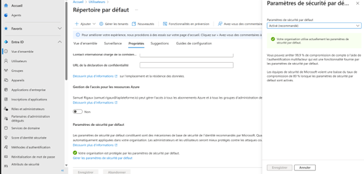
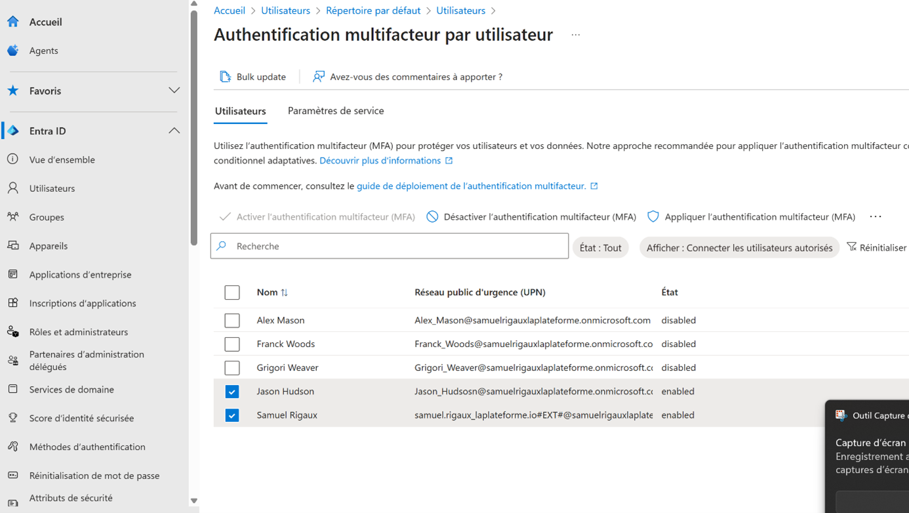

# Sécurisation de l'USS Enterprise avec EntraID AD

## Introduction

Ce projet détaille la sécurisation, l’automatisation et l’intégration applicative de l’USS Enterprise à travers Microsoft Entra ID (Azure AD) pour Starfleet :

-   **Sécurité avancée des identités**
    
-   **Automatisation via PowerShell**
    
-   **Intégration d'applications et gestion des rôles**
    
-   **Détection d’incidents et monitoring**
    

----------

## 1. Sécurité Avancée et Politiques de Sécurité

## 1.1 Détection et blocage des attaques sur les identités

-   Va dans **Vue d’ensemble** > **Propriétés** > **Gérer les paramètres de sécurité par défaut**
    
-   Active les paramètres de sécurité par défaut pour bénéficier des protections offertes gratuitement (politique MFA de base, blocage d’attaques courantes)
    

## 1.2 Activer MFA pour les officiers supérieurs

-   Va dans **Utilisateurs** > **Multi-Factor Authentication**
    
-   Sélectionne les comptes des officiers supérieurs et active le MFA
    

## 1.3 (OPTIONNEL/Premium) Restreindre l'accès par emplacement

> Fonctionnalité disponible uniquement en licence payante P1/P2

## 1.4 (OPTIONNEL/Premium) Tester les politiques par simulation

> Fonctionnalité disponible uniquement en licence payante P1/P2

----------

## 2. Automatisation avec PowerShell

## 2.1 Ajouter des utilisateurs Starfleet (recrues, transferts)

powershell

``Install-Module Microsoft.Graph -Scope CurrentUser Connect-MgGraph  -Scopes "User.ReadWrite.All"  
$PasswordProfile = @{  Password = "Starfleet2025!"  ForceChangePasswordNextSignIn = $true  }  
New-MgUser  -DisplayName "Jean-Luc Picard" `  -UserPrincipalName "picard@votre-domaine.onmicrosoft.com" `  -MailNickName "picard" `  -PasswordProfile $PasswordProfile `  -AccountEnabled`` 

**(Montre la fenêtre PowerShell de création d’utilisateur)**

## 2.2 Automatiser la gestion des groupes (ajout/suppression)

powershell

`# Création d'un groupe  New-MgGroup  -DisplayName "Equipe Médicale"  -MailEnabled:$false  -MailNickname "equipe-medicale"  -SecurityEnabled:$true  

## 2.3 Appliquer des politiques de sécurité à la demande

Pour simuler une politique de sécurité (désactiver un compte lors d’une mission sensible) :

powershell

`Set-MgUser  -UserId "picard@votre-domaine.onmicrosoft.com"  -AccountEnabled:$false` 

----------

## 3. Intégration et Sécurisation des Applications

## 3.1 Intégrer une application SaaS (Ex : Captain's Log)

-   Va dans **Applications d’entreprise** > **Nouvelle application**
    
-   Cherche l’application dans la galerie ou crée-en une personnalisée
    
-   Configure SSO (SAML recommandé)
    
    -   Identificateur : `https://captainslog.starfleet.com`
        
    -   URL de réponse : `https://captainslog.starfleet.com/saml/acs`
        
-   Ajoute les utilisateurs autorisés
    

## 3.2 Ajouter une application personnalisée et gérer les rôles (Repair Management)

-   Dans **Inscriptions d’applications** > **Nouvelle inscription** : renseigne le nom « Repair Management »
    
-   Dans **Rôles d’application** crée un rôle « Engineer » (modification) et « Reader » (lecture)
    
-   Dans **Applications d’entreprise** > **Utilisateurs et groupes** attribue les rôles aux comptes concernés
    

## 3.3 Test des accès 

-   Connecte-toi à [https://myapps.microsoft.com](https://myapps.microsoft.com/) avec différents profils pour vérifier les accès selon leur rôle
    

----------

## 4. Surveillance et Réponse aux Incidents

## 4.1 Surveillance des accès

-   Va dans **Azure AD > Surveillance** ou **Microsoft Entra > Logs des connexions**
    
-   Analyse les logs pour identifier des accès suspects aux ressources sensibles
    

## 4.2 Alertes et notifications

-   Avec l'édition gratuite : consulte régulièrement les logs
    
-   Avec les versions premium : configure des alertes automatiques sur activités anormales
    

----------

## Simuler un incident

-   Simule une connexion avec mot de passe incorrect répété sur un compte sensible
    
-   Observe dans les logs la détection de tentative de compromission
    
-   (Ajoute un texte expliquant la procédure de réponse : réinitialisation mot de passe, désactivation compte…)
    

----------

## Ressources complémentaires

-   Microsoft Learn : [https://learn.microsoft.com/fr-fr/entra](https://learn.microsoft.com/fr-fr/entra)
    
-   Microsoft Graph : [https://learn.microsoft.com/fr-fr/powershell/azure/new-azureadpshell-v2](https://learn.microsoft.com/fr-fr/powershell/azure/new-azureadpshell-v2)
    
-   Azure Security Center
    

----------

## Compétences mises en pratique

-   Administration sécurisée EntraID/AzureAD
    
-   Automatisation via PowerShell
    
-   Intégration applicative et gestion des rôles
    
-   Méthodes de test et de réponse à incident
